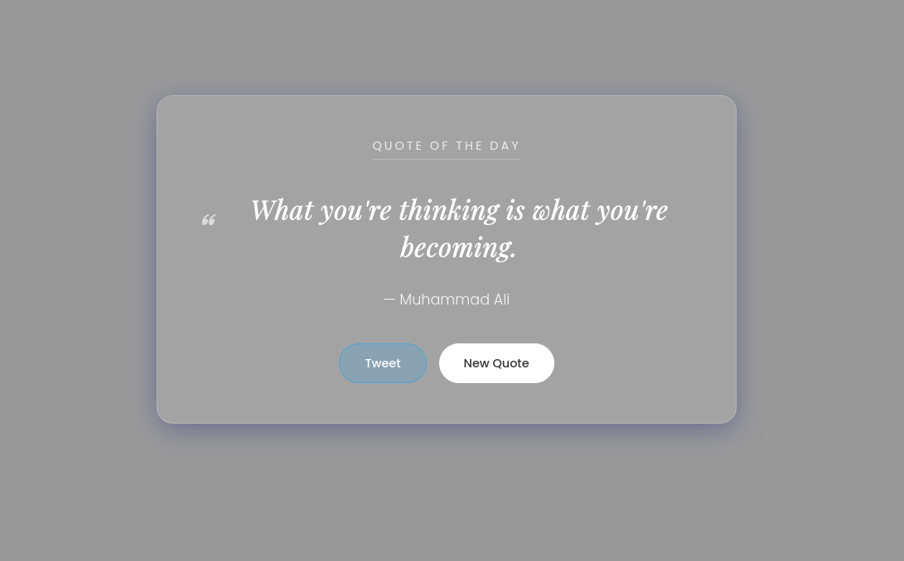

# ✨ Quote of the Day Generator

A modern, responsive web application that generates daily inspiration using a clean **Glassmorphism** UI design. This project fetches data asynchronously from an external API and allows users to share quotes directly to Twitter (X).




## 🚀 Features

* **Dynamic Content:** Fetches random quotes instantly using the Fetch API.
* **Modern UI:** Features a trendy "Glassmorphism" (frosted glass) aesthetic.
* **Social Sharing:** Integrated "Tweet This" button to share quotes on Twitter/X.
* **Responsive Design:** Looks great on desktops, tablets, and mobile devices.
* **Loading State:** Custom CSS spinner handles API latency gracefully.

## 🛠️ Tech Stack

* **HTML5:** Semantic structure.
* **CSS3:** Custom variables, Flexbox, and backdrop-filters.
* **JavaScript (ES6+):** Async/Await and DOM manipulation.
* **API:** [DummyJSON Quotes API](https://dummyjson.com/docs/quotes).

## 📂 Project Structure

This project follows the Separation of Concerns principle:

```text
/quote-of-the-day
│
├── index.html      # The structural markup
├── style.css       # The visual styling and animations
├── script.js       # The logic and API handling
└── README.md       # Project documentation
